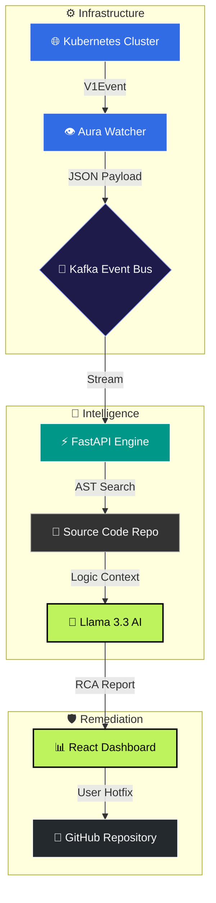

<div align="center">

  

  <br/>

  [](https://git.io/typing-svg)

  <br/>

  

  <br/><br/>

  [](https://kubernetes.io)
  [](https://fastapi.tiangolo.com)
  [](https://groq.com)
  [](https://kafka.apache.org)
  [](https://reactjs.org)

  <br/>

</div>

---

## 🚩 The Problem : The "Context Gap"

Traditional monitoring tools (Datadog, Prometheus) tell you *that* a service has failed — e.g., `CrashLoopBackOff` — but not *why* in the context of your code. Engineers waste hours:

1. Fetching logs from failing Pods
2. Matching logs to specific Git Commit IDs
3. Manually hunting for the buggy line in the repository

**Project Aura turns these hours into sub-second insights.**

---

## ✨ What Aura Does

Aura is an automated **Root Cause Analysis (RCA)** orchestrator that links infrastructure events directly to application logic.

| Feature | Description |
|---|---|
| 🕵️ **Automated Detection** | Watches the K8s API for failure events in real-time |
| 🔗 **Source-Aware Linking** | Clones the repo and uses **AST** to pinpoint the failing method |
| 🧠 **AI Reasoning** | Feeds `[Log + Code Context]` into **Llama 3.3** to generate a human-readable fix |
| 🛡️ **QA Gatekeeper** | Validates AI-generated hotfixes through an automated safety suite before suggesting remediation |

---

## 🏗️ Architecture



---

## ⚙️ Engineering Highlights

### 1. Intelligence Layer (Python / FastAPI)
The engine uses a **Recursive File Linker**. When a crash is detected at `AuthService.java:124`, it recursively searches the project tree, extracts the surrounding logic, and constructs a high-fidelity prompt for the LLM.

### 2. Self-Healing Workflow
Aura implements a full-circle remediation loop:

- **Intercept** — Catch `V1Event` from Kubernetes
- **Synthesize** — Map the stack trace to local `.java` source code
- **Reason** — LLM identifies logic flaws (e.g., missing Yoda-condition)
- **Validate** — QA suite scans the fix for safety violations (e.g., `System.exit`)

### 3. Interactive Playground
The **Cinematic Subspace Lab** lets you simulate infrastructure chaos and watch the "Nervous System" of the cluster respond in real-time — with Aura characters (Watcher, Oracle, Shield) orchestrating a self-healing cycle.

---

## 🛠️ Tech Stack

| Layer | Technologies |
|---|---|
| **DevOps** | Kubernetes (EKS), Fabric8, Apache Kafka |
| **AI / ML** | Llama 3.3 (70B), Groq Inference, LangChain |
| **Backend** | Python, FastAPI |
| **Source Analysis** | Java, AST Parsing |
| **Frontend** | React, Tailwind CSS v4, Framer Motion |

---

## 🚀 Getting Started

### Prerequisites
- Python 3.9+
- Node.js 18+
- A running Kubernetes cluster
- A [Groq API key](https://groq.com)

### Backend

```bash
cd backend
cp .env.example .env        # Add your GROQ_API_KEY
pip install -r requirements.txt
python main.py
```

### Frontend

```bash
cd frontend
npm install
npm run dev
```

---

## 📄 License

This project is open source. See [LICENSE](LICENSE) for details.

---

<div align="center">
  <p>Built with ❤️ by <b>Xynash</b></p>
  <p><i>Aura is dedicated to reducing MTTR through Source-Aware AIOps.</i></p>
</div>
 
