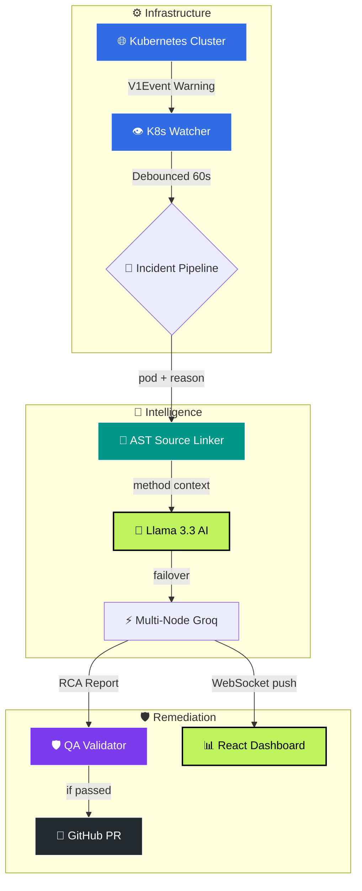

<div align="center">

  

  <br/>

  [](https://git.io/typing-svg)

  <br/>

  

  <br/><br/>

  [](https://kubernetes.io)
  [](https://fastapi.tiangolo.com)
  [](https://groq.com)
  [](https://reactjs.org)
  []()
  []()

  <br/>

</div>

---

## 🚩 The Problem: The "Context Gap"

Traditional monitoring tools (Datadog, Prometheus) tell you *that* a service has failed — e.g., `CrashLoopBackOff` — but not *why* in the context of your actual source code. Engineers waste hours:

1. Fetching logs from failing Pods
2. Matching logs to specific Git commits
3. Manually hunting for the buggy line in the repository

```
Pod crashes → Engineer paged → Hours of manual investigation → Fix pushed

              becomes

Pod crashes → Aura detects → AI reads source → PR created → Engineer reviews
              (0 seconds)     (< 30 seconds)                 (only human step)
```

**Project Aura closes that gap.**

---

## ✨ What Aura Does

Aura is an autonomous **Root Cause Analysis (RCA)** engine that links infrastructure events directly to application source code — and fixes them.

| Feature | Description |
|---|---|
| 👁️ **Autonomous Detection** | Watches the K8s API for failure events in real-time — no button press |
| 🔗 **AST Source Linking** | Finds the exact failing method using Java AST parsing, not grep |
| 🧠 **AI Reasoning** | Feeds `[Log + Code Context]` into **Llama 3.3 70B** via Groq for sub-second analysis |
| ⚡ **Multi-Node Failover** | 4 Groq API keys — hops automatically on rate limit for 99%+ AI availability |
| 🛡️ **QA Gatekeeper** | Scans AI-generated fixes for dangerous patterns before committing |
| 🐙 **Real GitHub PRs** | Creates branch, commits fix, opens PR autonomously via GitHub API |
| 📡 **WebSocket Pipeline** | Dashboard updates in under 1 second via persistent WebSocket — zero polling |
| 🧪 **Playground Mode** | Simulate any service crash without Minikube using `/simulate` endpoint |

---

## 🏗️ Architecture


```mermaid
graph TD
    subgraph Infrastructure["⚙️ Infrastructure"]
        A[🌐 Kubernetes Cluster] -->|V1Event Warning| B[👁️ K8s Watcher]
        B -->|Debounced 60s| C{🔀 Incident Pipeline}
    end

    subgraph Intelligence["🧠 Intelligence"]
        C -->|pod + reason| D[📂 AST Source Linker]
        D -->|method context| E[🤖 Llama 3.3 AI]
        E -->|failover| F[⚡ Multi-Node Groq]
    end

    subgraph Remediation["🛡️ Remediation"]
        F -->|RCA Report| G[🛡️ QA Validator]
        G -->|if passed| H[🐙 GitHub PR]
        F -->|WebSocket push| I[📊 React Dashboard]
    end

    style E fill:#bef35e,stroke:#000,stroke-width:2px,color:#000
    style I fill:#bef35e,stroke:#000,stroke-width:2px,color:#000
    style A fill:#326CE5,stroke:#fff,stroke-width:1px,color:#fff
    style B fill:#326CE5,stroke:#fff,stroke-width:1px,color:#fff
    style D fill:#009688,stroke:#fff,stroke-width:1px,color:#fff
    style G fill:#7c3aed,stroke:#fff,stroke-width:1px,color:#fff
    style H fill:#24292e,stroke:#fff,stroke-width:1px,color:#fff
```

---

## 🎯 Supported Services

| Pod Name | Source File | Bug Simulated |
|---|---|---|
| `auth-gateway` | `AuthService.java` | NullPointerException on `token.equals()` |
| `payment-api` | `PaymentService.java` | ArithmeticException: division by zero |
| `inventory-node` | `InventoryService.java` | NullPointerException on HashMap unboxing |

---

## ⚙️ Engineering Highlights

### 1. Autonomous Kubernetes Watcher
Runs as an `asyncio` background task on startup. Uses `kubernetes.watch.Watch()` to stream `V1Event` objects in real-time. When a `Warning` event fires for a Pod with reason `BackOff`, `Failed`, or `OOMKilling`, it fires the full RCA pipeline — no human trigger required.

A time-based debounce (`seen_pods` dict) prevents duplicate analyses when a pod crashes repeatedly in `CrashLoopBackOff`.

### 2. AST-Based Source Linking
When a crash is detected, Aura recursively searches the codebase and uses `javalang` to parse the Java AST. It finds the exact `MethodDeclaration` node containing the crash line number — giving the AI the full method context, not just a single line.

### 3. Multi-Node AI Failover
Four Groq API keys configured as `ALPHA`, `BRAVO`, `CHARLIE`, `DELTA` nodes. The engine tries each in sequence — if one is rate-limited or offline, it hops to the next instantly. This gives the system high availability even under heavy load.

### 4. Real QA Validation
Before any PR is created, the AI-generated fix is scanned for dangerous patterns: `System.exit`, `Runtime.getRuntime().exec`, `DROP TABLE`, `ProcessBuilder`, and others. A safety score (0-100) is calculated and displayed on the dashboard.

### 5. WebSocket Real-Time Pipeline
The React dashboard connects via WebSocket on load. When a pod dies, the backend pushes `incident_detected` immediately — the dashboard turns red in under 1 second. No polling, no refresh, no button.

---

## 🛠️ Tech Stack

| Layer | Technologies |
|---|---|
| **Infrastructure** | Kubernetes, Docker, Minikube |
| **Backend** | Python, FastAPI, asyncio |
| **AI / ML** | Llama 3.3 (70B), Groq Inference |
| **Source Analysis** | javalang, AST Parsing |
| **Automation** | PyGitHub, GitHub API |
| **Frontend** | React, TypeScript, Tailwind CSS, Framer Motion |
| **Realtime** | WebSocket, FastAPI WebSocket |

---

## 🚀 Getting Started

### Prerequisites
- Python 3.11+
- Node.js 18+
- Docker Desktop
- Minikube (optional — Playground works without it)
- [Groq API key](https://console.groq.com) (free)
- GitHub token with `repo` scope

### Backend

```bash
cd backend
cp .env.example .env        # fill in your keys
pip install -r requirements.txt
python main.py
```

Expected output:
```
💻 Loaded local kubeconfig (Minikube mode).
👁️  Aura Watcher armed — namespace: 'default'
🚀 Aura Engine online. Watcher armed.
```

### Frontend

```bash
cd frontend
npm install
npm run dev
```

---

## 🔥 Demo — Autonomous Mode (with Minikube)

```bash
# 1. Start cluster
minikube start

# 2. Start backend — watcher connects automatically
python main.py

# 3. Trigger a real incident — watch dashboard, don't touch anything
kubectl run payment-api --image=busybox --restart=Always -- sh -c "exit 1"

# Dashboard turns red autonomously within 15 seconds
# AI analyzes PaymentService.java
# GitHub PR created automatically

# 4. Cleanup
kubectl delete pod payment-api
```

## 🧪 Demo — Playground Mode (no Minikube needed)

Open `http://localhost:5174/playground`

Click any chaos button — the real AI pipeline fires, WebSocket broadcasts, dashboard updates. Full RCA with zero infrastructure setup.

---

## 📡 API Reference

| Endpoint | Method | Description |
|---|---|---|
| `/health` | GET | System status, node count, watcher state |
| `/analyze` | POST | Manual RCA trigger |
| `/simulate/{service}` | POST | Playground simulation — no K8s needed |
| `/remediate` | GET | QA validate + create GitHub PR |
| `/chat` | POST | Neural Assistant chatbot |
| `/metrics` | GET | Live counters: incidents, PRs, failovers |
| `/history` | GET | Last 10 incidents |
| `/ws/incidents` | WS | Real-time event stream |

---

## ✅ Tests

```bash
cd backend
pytest test_aura.py -v
```

```
test_aura.py::test_find_auth_service                      PASSED
test_aura.py::test_find_payment_service                   PASSED
test_aura.py::test_find_inventory_service                 PASSED
test_aura.py::test_find_nonexistent_file                  PASSED
test_aura.py::test_get_method_context_returns_code        PASSED
test_aura.py::test_get_method_context_returns_method_name PASSED
test_aura.py::test_pod_maps_to_auth                       PASSED
test_aura.py::test_pod_maps_to_payment                    PASSED
test_aura.py::test_pod_maps_to_inventory                  PASSED
test_aura.py::test_unknown_pod_fallback                   PASSED
test_aura.py::test_partial_match_works                    PASSED
test_aura.py::test_extract_from_real_stack_trace          PASSED
test_aura.py::test_extract_fallback_to_pod_map            PASSED
test_aura.py::test_debounce_first_trigger_passes          PASSED
test_aura.py::test_debounce_second_trigger_blocked        PASSED
test_aura.py::test_qa_passes_clean_code                   PASSED
test_aura.py::test_qa_blocks_system_exit                  PASSED
test_aura.py::test_qa_blocks_runtime_exec                 PASSED
test_aura.py::test_qa_score_decreases_per_violation       PASSED

19 passed in 1.68s
```

---

## 📁 Project Structure

```
Aura/
├── backend/
│   ├── main.py                      # FastAPI engine — 400 lines
│   ├── test_aura.py                 # 19 tests
│   ├── requirements.txt
│   ├── .env.example                 # safe config template
│   ├── Procfile                     # Railway deployment
│   ├── runtime.txt                  # Python 3.11
│   └── mock_repo/
│       └── src/main/java/io/aura/
│           ├── AuthService.java         # NullPointerException bug
│           ├── payment/
│           │   └── PaymentService.java  # Division by zero bug
│           └── inventory/
│               └── InventoryService.java # HashMap null bug
└── frontend/
    └── src/
        ├── config.ts                # API/WS URL config
        ├── hooks/
        │   └── useAuraSocket.ts     # WebSocket hook
        └── pages/
            ├── Dashboard.tsx        # Cluster mesh, live metrics
            ├── Incidents.tsx        # RCA report, source, PR
            └── Playground.tsx       # Chaos simulation
```

---

## 🌐 Deployment

### Backend — Railway

### Frontend — Vercel

---

## 📄 License

This project is open source. See [LICENSE](LICENSE) for details.

---

<div align="center">
  <p>Built with ❤️ by <b>Ansh Sharma</b></p>
  <p><i>Aura is dedicated to reducing MTTR through Source-Aware AIOps.</i></p>
</div>
